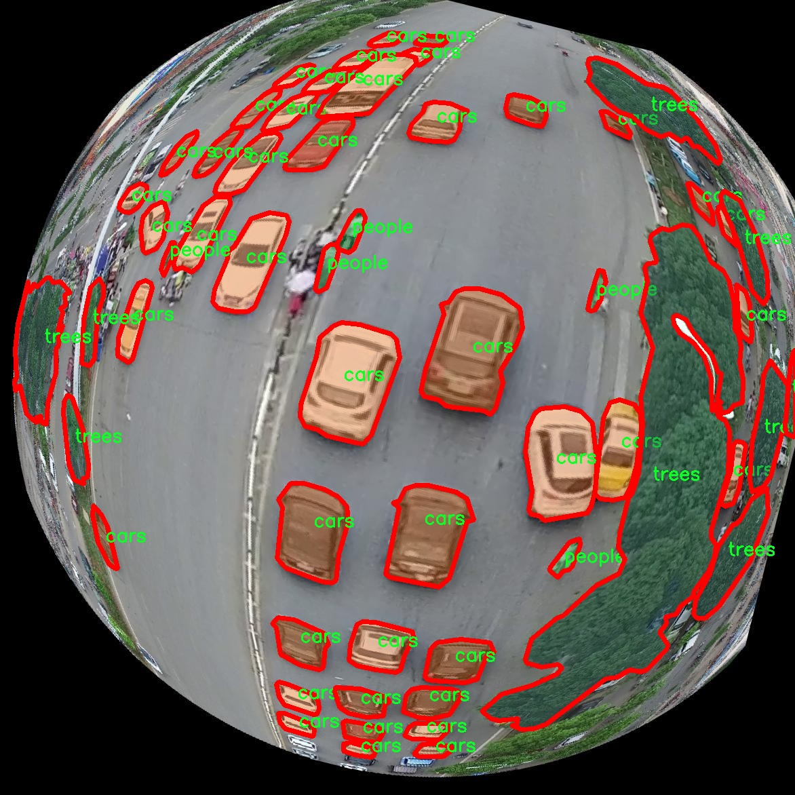

# 鱼眼相机城市环境图像分割系统源码＆数据集分享
 [yolov8-seg-SPDConv＆yolov8-seg-vanillanet等50+全套改进创新点发刊_一键训练教程_Web前端展示]

### 1.研究背景与意义

项目参考[ILSVRC ImageNet Large Scale Visual Recognition Challenge](https://gitee.com/YOLOv8_YOLOv11_Segmentation_Studio/projects)

项目来源[AAAI Global Al lnnovation Contest](https://kdocs.cn/l/cszuIiCKVNis)

研究背景与意义

随着城市化进程的加快，城市环境的复杂性日益增加，如何有效地对城市环境进行智能化管理与监测成为了一个亟待解决的问题。城市环境中包含多种物体，如建筑物、车辆、行人和树木等，这些元素的分布和变化直接影响着城市的生态环境、交通管理和公共安全。因此，针对城市环境的图像分割技术的研究具有重要的理论价值和实际意义。近年来，深度学习技术的迅猛发展为图像分割提供了新的解决方案，尤其是YOLO（You Only Look Once）系列模型因其高效的实时检测能力而备受关注。

在众多YOLO模型中，YOLOv8以其更高的准确性和更快的推理速度，成为了图像分割领域的研究热点。然而，传统的YOLOv8模型在处理复杂城市环境图像时，尤其是使用鱼眼相机获取的图像时，仍然面临着许多挑战。鱼眼相机因其广角视野和独特的成像特性，能够捕捉到更广泛的场景信息，但同时也引入了严重的畸变问题。这种畸变使得物体的边界变得模糊，增加了图像分割的难度。因此，改进YOLOv8以适应鱼眼相机图像的特性，成为了一个具有重要研究价值的课题。

本研究旨在基于改进的YOLOv8模型，构建一个针对鱼眼相机城市环境图像的分割系统。为此，我们将利用COCO格式的数据集，该数据集包含1300张图像，涵盖建筑物、车辆、行人和树木四个类别。这些类别的选择不仅反映了城市环境的主要组成部分，也为我们提供了丰富的训练样本，有助于提高模型的泛化能力。通过对数据集的深入分析和处理，我们将能够更好地理解城市环境中各类物体的特征及其相互关系，从而为后续的模型改进提供理论依据。

此外，研究的意义还体现在以下几个方面：首先，改进YOLOv8模型能够提高城市环境图像分割的准确性和效率，为城市管理提供更加精确的数据支持。其次，基于鱼眼相机的图像分割系统能够为智能交通、环境监测等应用提供技术保障，推动城市智能化发展。最后，本研究将为图像处理和计算机视觉领域提供新的思路和方法，促进相关技术的进一步发展。

综上所述，基于改进YOLOv8的鱼眼相机城市环境图像分割系统的研究，不仅具有重要的学术价值，也将为实际应用提供有力支持。通过对城市环境的深入分析与智能化处理，我们期待能够为构建更加美好的城市环境贡献一份力量。

### 2.图片演示


##### 注意：由于此博客编辑较早，上面“2.图片演示”和“3.视频演示”展示的系统图片或者视频可能为老版本，新版本在老版本的基础上升级如下：（实际效果以升级的新版本为准）

  （1）适配了YOLOV8的“目标检测”模型和“实例分割”模型，通过加载相应的权重（.pt）文件即可自适应加载模型。

  （2）支持“图片识别”、“视频识别”、“摄像头实时识别”三种识别模式。

  （3）支持“图片识别”、“视频识别”、“摄像头实时识别”三种识别结果保存导出，解决手动导出（容易卡顿出现爆内存）存在的问题，识别完自动保存结果并导出到tempDir中。

  （4）支持Web前端系统中的标题、背景图等自定义修改，后面提供修改教程。

  另外本项目提供训练的数据集和训练教程,暂不提供权重文件（best.pt）,需要您按照教程进行训练后实现图片演示和Web前端界面演示的效果。

### 3.视频演示

[3.1 视频演示](https://www.bilibili.com/video/BV1BHmBYFEJg/)

### 4.数据集信息展示

##### 4.1 本项目数据集详细数据（类别数＆类别名）

nc: 4
names: ['building', 'cars', 'people', 'trees']


##### 4.2 本项目数据集信息介绍

数据集信息展示

在本研究中，我们采用了名为“COCO-format”的数据集，以支持改进YOLOv8-seg模型在鱼眼相机城市环境图像分割系统中的训练与评估。该数据集专门设计用于处理城市环境中的图像分割任务，具有良好的多样性和代表性，能够有效提升模型在实际应用中的表现。

“COCO-format”数据集包含四个主要类别，分别是建筑物（building）、汽车（cars）、行人（people）和树木（trees）。这些类别的选择反映了城市环境中常见的元素，能够帮助模型更好地理解和分割复杂的场景。在实际应用中，建筑物作为城市的基础设施，不仅影响着城市的美观，还对人们的生活和工作产生重要影响；汽车则是现代城市交通的重要组成部分，行人与汽车之间的互动关系也极为复杂；而树木作为城市绿化的重要元素，不仅提升了城市的生态环境，也为居民提供了休闲空间。

数据集中每个类别的样本数量经过精心挑选，确保了训练数据的均衡性和多样性。建筑物类别的样本涵盖了不同风格和高度的建筑，反映了城市建筑的多样性；汽车类别则包括各种类型的车辆，如轿车、SUV和公共交通工具，体现了城市交通的复杂性；行人类别则包含了不同性别、年龄和服装风格的人物，确保了模型能够适应不同的人群特征；树木类别则涵盖了多种树种，展示了城市绿化的多样性。这种多样化的样本选择使得模型在面对不同城市环境时，能够更好地进行特征提取和分割。

在数据预处理阶段，我们对“COCO-format”数据集进行了必要的增强和标准化处理，以提高模型的鲁棒性和泛化能力。通过对图像进行旋转、缩放、裁剪和颜色调整等操作，我们能够有效扩展训练样本的多样性，从而使模型在训练过程中更好地学习到各类特征。此外，针对鱼眼相机特有的图像畸变，我们还进行了相应的校正处理，以确保输入数据的质量和准确性。

为了评估模型的性能，我们将数据集划分为训练集、验证集和测试集，确保每个类别在各个子集中均衡分布。这种划分方式不仅能够有效防止过拟合现象的发生，还能为模型的实际应用提供可靠的性能指标。在模型训练过程中，我们将重点关注分割精度、召回率和F1-score等关键指标，以全面评估模型在城市环境图像分割任务中的表现。

综上所述，“COCO-format”数据集为本研究提供了丰富的训练素材和良好的实验基础。通过对该数据集的有效利用，我们期望能够显著提升改进YOLOv8-seg模型在鱼眼相机城市环境图像分割任务中的性能，为未来的智能城市建设和相关应用提供有力支持。





### 5.全套项目环境部署视频教程（零基础手把手教学）

[5.1 环境部署教程链接（零基础手把手教学）](https://www.bilibili.com/video/BV1jG4Ve4E9t/?vd_source=bc9aec86d164b67a7004b996143742dc)


[5.2 安装Python虚拟环境创建和依赖库安装视频教程链接（零基础手把手教学）](https://www.bilibili.com/video/BV1nA4VeYEze/?vd_source=bc9aec86d164b67a7004b996143742dc)

### 6.手把手YOLOV8-seg训练视频教程（零基础小白有手就能学会）

[6.1 手把手YOLOV8-seg训练视频教程（零基础小白有手就能学会）](https://www.bilibili.com/video/BV1cA4VeYETe/?vd_source=bc9aec86d164b67a7004b996143742dc)


按照上面的训练视频教程链接加载项目提供的数据集，运行train.py即可开始训练



     Epoch   gpu_mem       box       obj       cls    labels  img_size
     1/200     0G   0.01576   0.01955  0.007536        22      1280: 100%|██████████| 849/849 [14:42<00:00,  1.04s/it]
               Class     Images     Labels          P          R     mAP@.5 mAP@.5:.95: 100%|██████████| 213/213 [01:14<00:00,  2.87it/s]
                 all       3395      17314      0.994      0.957      0.0957      0.0843

     Epoch   gpu_mem       box       obj       cls    labels  img_size
     2/200     0G   0.01578   0.01923  0.007006        22      1280: 100%|██████████| 849/849 [14:44<00:00,  1.04s/it]
               Class     Images     Labels          P          R     mAP@.5 mAP@.5:.95: 100%|██████████| 213/213 [01:12<00:00,  2.95it/s]
                 all       3395      17314      0.996      0.956      0.0957      0.0845

     Epoch   gpu_mem       box       obj       cls    labels  img_size
     3/200     0G   0.01561    0.0191  0.006895        27      1280: 100%|██████████| 849/849 [10:56<00:00,  1.29it/s]
               Class     Images     Labels          P          R     mAP@.5 mAP@.5:.95: 100%|███████   | 187/213 [00:52<00:00,  4.04it/s]
                 all       3395      17314      0.996      0.957      0.0957      0.0845


### 7.50+种全套YOLOV8-seg创新点代码加载调参视频教程（一键加载写好的改进模型的配置文件）

[7.1 50+种全套YOLOV8-seg创新点代码加载调参视频教程（一键加载写好的改进模型的配置文件）](https://www.bilibili.com/video/BV1Hw4VePEXv/?vd_source=bc9aec86d164b67a7004b996143742dc)

### 8.YOLOV8-seg图像分割算法原理

原始YOLOv8-seg算法原理

YOLOv8-seg作为YOLO系列中的最新成员，于2023年1月正式推出，标志着计算机视觉领域在目标检测与实例分割任务中的又一次重大进步。该算法在精度和执行时间方面均表现出色，超越了以往的所有模型，成为实时目标检测和分割任务的最先进解决方案。YOLOv8的设计灵感源自于其前辈们，如YOLOv5、YOLOv6和YOLOX，结合了这些模型的优点，并在此基础上进行了全面的改进和优化。

YOLOv8的核心结构分为输入端、主干网络、颈部网络和头部网络四个部分。输入端通过马赛克数据增强、自适应锚框计算和自适应灰度填充等技术，为模型提供了丰富且多样化的训练数据，增强了模型的鲁棒性。主干网络则采用了新型的C2f模块，这一模块的设计借鉴了YOLOv7中的ELAN结构，通过增加更多的残差连接，提升了梯度流动的效率，使得特征学习更加深入。与YOLOv5中的C3模块相比，C2f模块不仅提高了特征表示能力，还在轻量化的基础上，确保了模型的高效性。

在颈部网络方面，YOLOv8依然采用了路径聚合网络（PAN）结构，这一结构在不同尺度对象的特征融合上表现出色。PAN通过跨层连接，增强了模型对不同大小目标的检测能力，确保了小目标的识别不被忽视。YOLOv8的头部网络则是其最显著的创新之一，采用了解耦合头结构，将分类和检测过程分开处理，显著提高了模型的灵活性和准确性。与以往的Anchor-Based方法不同，YOLOv8引入了Anchor-Free的检测头，简化了锚框的预测过程，减少了计算负担，并加速了非最大抑制（NMS）过程。

YOLOv8的损失函数设计也体现了其创新性。分类损失采用了二元交叉熵损失（BCELoss），而回归损失则结合了分布焦点损失（DFLoss）和完全交并比损失（CIOULoss），以提升模型对边界框预测的精准性。这种损失函数的设计使得YOLOv8在处理复杂场景时，能够更好地平衡分类和回归任务，进而提高整体性能。

此外，YOLOv8在训练过程中引入了动态样本分配策略，即Task-Aligned Assigner。这一策略根据分类与回归的分数加权结果选择正样本，确保模型在训练时能够充分利用每一个样本的信息，从而加速收敛并提升最终的检测精度。通过这些创新，YOLOv8不仅在精度上实现了质的飞跃，同时在执行速度上也保持了良好的表现，适应了实时应用的需求。

YOLOv8的多种模型配置（如n、s、m、l、x）使其能够灵活应对不同的应用场景和硬件条件。每种模型在参数量、深度和特征图宽度上有所不同，用户可以根据具体需求选择合适的版本。例如，YOLOv8n作为参数量最小且检测速度最快的版本，适合对实时性要求极高的应用场景，而YOLOv8x则在检测精度上表现更为突出，适合需要高精度的任务。

总的来说，YOLOv8-seg算法通过一系列的创新和优化，充分利用了现代深度学习技术的优势，极大地提升了目标检测与实例分割的性能。其在设计上的灵活性和高效性，使得YOLOv8成为了当前计算机视觉领域中最具竞争力的模型之一。无论是在学术研究还是工业应用中，YOLOv8都展现出了广泛的应用前景，推动了计算机视觉技术的进一步发展。


### 9.系统功能展示（检测对象为举例，实际内容以本项目数据集为准）

图9.1.系统支持检测结果表格显示

  图9.2.系统支持置信度和IOU阈值手动调节

  图9.3.系统支持自定义加载权重文件best.pt(需要你通过步骤5中训练获得)

  图9.4.系统支持摄像头实时识别

  图9.5.系统支持图片识别

  图9.6.系统支持视频识别

  图9.7.系统支持识别结果文件自动保存

  图9.8.系统支持Excel导出检测结果数据


### 10.50+种全套YOLOV8-seg创新点原理讲解（非科班也可以轻松写刊发刊，V11版本正在科研待更新）

#### 10.1 由于篇幅限制，每个创新点的具体原理讲解就不一一展开，具体见下列网址中的创新点对应子项目的技术原理博客网址【Blog】：


[10.1 50+种全套YOLOV8-seg创新点原理讲解链接](https://gitee.com/qunmasj/good)

#### 10.2 部分改进模块原理讲解(完整的改进原理见上图和技术博客链接)【如果此小节的图加载失败可以通过CSDN或者Github搜索该博客的标题访问原始博客，原始博客图片显示正常】
### YOLOv8简介
根据官方描述，Yolov8是一个SOTA模型，它建立在Yolo系列历史版本的基础上，并引入了新的功能和改进点，以进一步提升性能和灵活性，使其成为实现目标检测、图像分割、姿态估计等任务的最佳选择。其具体创新点包括一个新的骨干网络、一个新的Ancher-Free检测头和一个新的损失函数，可在CPU到GPU的多种硬件平台上运行。
此外，Yolov8还有一个特点就是可扩展性，ultralytics没有直接将开源库命名为Yolov8，而是直接使用"ultralytcs"，将其定位为算法框架，而非某一个特定算法。这也使得Yolov8开源库不仅仅能够用于Yolo系列模型，而且能够支持非Yolo模型以及分类分割姿态估计等各类任务。
总而言之，Yolov8是Yolo系列模型的最新王者，各种指标全面超越现有对象检测与实例分割模型，借鉴了Yolov5、Yolov6、YoloX等模型的设计优点，在全面提升改进Yolov5模型结构的基础上实现，同时保持了Yolov5工程化简洁易用的优势。

#### Yolov8创新点
Yolov8主要借鉴了Yolov5、Yolov6、YoloX等模型的设计优点，其本身创新点不多，偏重在工程实践上，具体创新如下:
·提供了一个全新的SOTA模型（包括P5 640和P6 1280分辨率的目标检测网络和基于YOLACT的实例分割模型)。并且，基于缩放系数提供了N/S/M/L/X不同尺度的模型，以满足不同部署平台和应用场景的需求。
. Backbone:同样借鉴了CSP模块思想，不过将Yolov5中的C3模块替换成了C2f模块
实现了进—步轻量化，同时沿用Yolov5中的
SPPF模块，并对不同尺度的模型进行精心微调，不再是无脑式一套参数用于所有模型，大幅提升了模型性能。
。Neck:继续使用PAN的思想，但是通过对比YOLOv5与YOLOv8的结构图可以看到，YOLOv8移除了1*1降采样层。
·Head部分相比YOLOv5改动较大，Yolov8换成了目前主流的解耦头结构(Decoupled-Head)，将分类和检测头分离，同时也从Anchor-Based换成了Anchor-Free。
·Loss计算:使用VFLLoss作为分类损失(实际训练中使用BCE Loss);使用DFLLoss+CIOU Loss作为回归损失。
。标签分配: Yolov8抛弃了以往的loU分配或者单边比例的分配方式，而是采用Task-Aligned Assigner正负样本分配策略。
#### Yolov8网络结构
Yolov8模型网络结构图如下图所示。


### Diverse Branch Block简介
参考该博客提出的一种通用的卷积网络构造块用来在不增加任何推理时间的前提下提升卷积网络的性能。我们将这个块命名为分离分支块（Diverse Branch Block）。通过结合不同尺寸和复杂度的分离分支（包括串联卷积、多尺度卷积和平均池化层）来增加特征空间的方法，它提升了单个卷积的表达能力。完成训练后，一个DBB(Diverse Branch Block)可以被等价地转换为一个单独的卷积操作以方便部署。不同于那些新颖的卷积结构的改进方式，DBB让训练时微结构复杂化同时维持大规模结构，因此我们可以将它作为任意结构中通用卷积层的一种嵌入式替代形式。通过这种方式，我们能够将模型训练到一个更高的表现水平，然后在推理时转换成原始推理时间的结构。

 
主要贡献点：

（1） 我们建议合并大量的微结构到不同的卷积结构中来提升性能，但是维持原始的宏观结构。

（2）我们提出DBB，一个通用构造块结构，概括六种转换来将一个DBB结构转化成一个单独卷积，因为对于用户来说它是无损的。

（3）我们提出一个Inception-like DBB结构实例(Fig 1)，并且展示它在ImageNet、COCO detection 和CityScapes任务中获得性能提升。


#### 结构重参数化
本文和一个并发网络RepVGG[1]是第一个使用结构重参数化来命名该思路------使用从其他结构转化来的参数确定当前结构的参数。一个之前的工作ACNet[2]也可以被划分为结构重参数化，它提出使用非对称卷积块来增强卷积核的结构（i.e 十字形结构）。相比于DBB，它被设计来提升卷积网络（在没有额外推理时间损失的条件下）。这个流水线也包含将一个训练好的模型转化为另一个。但是，ACNet和DBB的区别是：ACNet的思想被激发是基于一个观察，这个观察是网络结构的参数在过去有更大的量级，因此寻找方法让参数量级更大，然而我们关注一个不同的点。我们发现 平均池化、1x1 conv 和 1x1-kxk串联卷积是更有效的，因为它们提供了不同复杂度的路线，以及允许使用更多训练时非线性化。除此以外，ACB结构可以看作是DBB结构的一种特殊形式，因为那个1xk和kx1卷积层能够被扩大成kxk（via Transform VI(Fig.2)），然后合并成一个平方核（via Transform II）。

 

#### 分离分支结构
卷积的线性性
一个卷积操作可以表示为 ，其中为输入tensor, 为输出tensor。卷积核表示为一个四阶tensor , 偏置为。将加偏置的操作表示为。

因为，在第j个输出通道（h,w）位置的值可以由以下公式给出：，其中表示输入帧I的第c个通道上的一个滑动窗，对应输出帧O的坐标（h,w）。从上式可以看出，卷积操作具有齐次性和加法性。


注意：加法性成立的条件是两个卷积具有相同的配置（即通道数、核尺寸、步长和padding等）。

#### 分离分支的卷积
在这一小节，我们概括六种转换形式（Fig.2）来转换一个具有batch normalization(BN)、branch addition、depth concatenation、multi-scale operations、avarage pooling 和 sequences of convolutions的DBB分支。


Transform I：a conv for conv-BN  我们通常会给一个卷积配备配备一个BN层，它执行逐通道正则化和线性尺度放缩。设j为通道索引，分别为累积的逐通道均值和标准差，分别为学习的尺度因子和偏置项，对应输出通道j为


卷积的齐次性允许我们融合BN操作到前述的conv来做推理。在实践中，我们仅仅建立一个拥有卷积核和偏置, 用从原始BN序列的参数转换来的值来赋值。我们为每个输出通道j构造


Transform II a conv for branch addition  卷积的加法性确保如果有两个或者多个具有相同配置的卷积层相加，我们能够将它们合并到一个单独的卷积里面。对于conv-BN，我们应该首先执行Transform I。很明显的，通过下面的公式我们能够合并两个卷积


上述公式只有在两个卷积拥有相同配置时才成立。尽管合并上述分支能够在一定程度上增强模型，我们希望结合不同分支来进一步提升模型性能。在后面，我们介绍一些分支的形式，它们能够等价地被转化为一个单独的卷积。在通过多个转化来为每一个分支构造KxK的卷积之后，我们使用Transform II 将所有分支合并到一个conv里面。

Transform III: a conv for sequential convolutions   我们能够合并一个1x1 conv-BN-kxk conv序列到一个kxk conv里面。我们暂时假设卷积是稠密的（即 组数 groups=1）。组数groups>1的情形将会在Transform IV中实现。我们假定1x1和kxk卷积层的核形状分别是DxCx1x1和ExDxKxK，这里D指任意值。首先，我们将两个BN层融合到两个卷积层里面，由此获得。输出是


我们期望用一个单独卷积的核和偏置来表达，设, 它们满足。对方程（8）应用卷积的加法性，我们有


因为是一个1x1 conv，它只执行逐通道线性组合，没有空间聚合操作。通过线性重组KxK卷积核中的参数，我们能够将它合并到一个KxK的卷积核里面。容易证明的是，这样的转换可以由一个转置卷积实现：


其中是由转置获得的tensor张量。方程（10）的第二项是作用于常量矩阵上的卷积操作，因此它的输出也是一个常量矩阵。用表达式来说明，设是一个常数矩阵，其中的每个元素都等于p。*是一个2D 卷积操作，W为一个2D 卷积核。转换结果就是一个常量矩阵，这个常量矩阵是p 与 所有核元素之和 的乘积，即


基于以上观察，我们构造。然后，容易证明。

因此我们有

显而易见地，对于一个zero-pads 的KxK卷积，方程（8）并不成立，因为并不对的结果做卷积操作(如果有一个零元素的额外的圈，方程（8）成立)。解决方案有A)用padding配置第一个卷积，第二个卷积不用，B)通过做pad操作。后者的一个有效实现是定制第一个BN层，为了（1）如通常的batch-normalize输入。（2）计算(通过方程（6）)。（3）用  pad batch-normalized结果，例如 用一圈 pad 每一个通道j 。

Transform IV: a conv for depth concatenation  Inception 单元使用深度concatenation来组合不同分支。当每个分支都只包含一个相同配置的卷积时，深度concatenation等价于一个卷积，它的核在不同的输出通道上concatenation（比如我们公式中的第一个轴）假设。我们concatenate它们到。显然地


Transform IV 可以非常方便地将Transform III 扩展到 groupwise（即 groups > 1） 的情景。直觉上，一个groupwise 卷积将输入分割成g个并行的组，单独卷积它们，然后concatenate形成输出。为了代替g-group卷积，我们建立一个DBB结构，这个结构的所有卷积层有相同的组g。为了转换一个1x1-KxK序列，我们等价地分割它们成为g组，单独执行Transform III, 然后concatenate获得输出（如图Fig3所示）。


Transform V: a conv for average pooling  一个作用于C通道的核尺寸为K，步长为s的平均池化层等价于一个拥有相同核尺寸K,步长s的卷积层。这样的核可以被构造为

  


就像一个通常的平均池化操作，当s>1时执行降采样操作，当s=1时保持相同尺寸。

Transform VI: a conv for multi-scale convolutions   考虑一个等价于一个拥有相同zero padding的 核。特别地，卷积是格外实用的，因为它们能够有效实现。应该对输入作pad操作来对齐滑动窗。


### 11.项目核心源码讲解（再也不用担心看不懂代码逻辑）

#### 11.1 ultralytics\models\yolo\model.py

以下是对代码的核心部分进行保留和详细注释的结果：

```python
# 导入所需的类和模块
from ultralytics.engine.model import Model
from ultralytics.models import yolo  # noqa
from ultralytics.nn.tasks import ClassificationModel, DetectionModel, PoseModel, SegmentationModel

class YOLO(Model):
    """YOLO (You Only Look Once) 目标检测模型的类定义。"""

    @property
    def task_map(self):
        """将任务类型映射到相应的模型、训练器、验证器和预测器类。

        返回一个字典，其中包含四种任务类型（分类、检测、分割、姿态）及其对应的类。
        """
        return {
            'classify': {  # 分类任务
                'model': ClassificationModel,  # 使用的模型类
                'trainer': yolo.classify.ClassificationTrainer,  # 训练器类
                'validator': yolo.classify.ClassificationValidator,  # 验证器类
                'predictor': yolo.classify.ClassificationPredictor,  # 预测器类
            },
            'detect': {  # 检测任务
                'model': DetectionModel,  # 使用的模型类
                'trainer': yolo.detect.DetectionTrainer,  # 训练器类
                'validator': yolo.detect.DetectionValidator,  # 验证器类
                'predictor': yolo.detect.DetectionPredictor,  # 预测器类
            },
            'segment': {  # 分割任务
                'model': SegmentationModel,  # 使用的模型类
                'trainer': yolo.segment.SegmentationTrainer,  # 训练器类
                'validator': yolo.segment.SegmentationValidator,  # 验证器类
                'predictor': yolo.segment.SegmentationPredictor,  # 预测器类
            },
            'pose': {  # 姿态估计任务
                'model': PoseModel,  # 使用的模型类
                'trainer': yolo.pose.PoseTrainer,  # 训练器类
                'validator': yolo.pose.PoseValidator,  # 验证器类
                'predictor': yolo.pose.PosePredictor,  # 预测器类
            },
        }
```

### 代码分析：
1. **导入模块**：代码开始部分导入了必要的模块和类，这些类是YOLO模型的基础组件。
2. **YOLO类**：定义了一个名为`YOLO`的类，继承自`Model`类，表示YOLO目标检测模型。
3. **task_map属性**：该属性返回一个字典，映射了不同任务（分类、检测、分割、姿态）到相应的模型、训练器、验证器和预测器类。这种设计使得模型可以灵活地处理不同的任务类型。

### 总结：
该代码的核心在于`YOLO`类及其`task_map`属性，它为YOLO模型提供了多种任务的支持，方便后续的训练和预测操作。

这个文件定义了一个名为 `YOLO` 的类，该类继承自 `Model` 类，主要用于实现 YOLO（You Only Look Once）目标检测模型。YOLO 是一种广泛使用的实时目标检测算法，能够在单个前向传播中同时进行目标分类和定位。

在 `YOLO` 类中，有一个名为 `task_map` 的属性，它返回一个字典，该字典将不同的任务类型（如分类、检测、分割和姿态估计）映射到相应的模型、训练器、验证器和预测器类。具体来说，字典的结构如下：

- 对于 `classify`（分类）任务，映射到 `ClassificationModel` 作为模型，`ClassificationTrainer` 作为训练器，`ClassificationValidator` 作为验证器，以及 `ClassificationPredictor` 作为预测器。
- 对于 `detect`（检测）任务，映射到 `DetectionModel`，`DetectionTrainer`，`DetectionValidator` 和 `DetectionPredictor`。
- 对于 `segment`（分割）任务，映射到 `SegmentationModel`，`SegmentationTrainer`，`SegmentationValidator` 和 `SegmentationPredictor`。
- 对于 `pose`（姿态估计）任务，映射到 `PoseModel`，`PoseTrainer`，`PoseValidator` 和 `PosePredictor`。

通过这种方式，`YOLO` 类能够灵活地支持多种计算机视觉任务，并且可以根据不同的任务类型选择相应的模型和工具。这种设计使得代码结构清晰，易于扩展和维护，便于开发者在实际应用中使用 YOLO 模型进行各种视觉任务。

#### 11.2 ultralytics\utils\errors.py

```python
# 导入emojis函数，用于处理错误信息中的表情符号
from ultralytics.utils import emojis

class HUBModelError(Exception):
    """
    自定义异常类，用于处理与Ultralytics YOLO模型获取相关的错误。

    当请求的模型未找到或无法检索时，将引发此异常。
    消息经过处理，以包含表情符号，从而改善用户体验。

    属性:
        message (str): 引发异常时显示的错误消息。

    注意:
        消息会通过'ultralytics.utils'包中的'emojis'函数自动处理。
    """

    def __init__(self, message='Model not found. Please check model URL and try again.'):
        """当模型未找到时创建异常。"""
        # 调用父类的构造函数，并将处理过的消息传递给它
        super().__init__(emojis(message))
``` 

### 代码核心部分说明：
1. **异常类定义**：`HUBModelError`类继承自Python内置的`Exception`类，用于定义一个特定的异常类型，便于处理模型获取中的错误。
2. **构造函数**：`__init__`方法接受一个可选的错误消息参数，默认消息为“模型未找到，请检查模型URL并重试。”，并通过`emojis`函数处理该消息，以增强用户体验。
3. **异常处理**：当模型无法找到时，可以通过抛出`HUBModelError`异常来提示用户，帮助用户更好地理解问题所在。

这个程序文件定义了一个自定义异常类 `HUBModelError`，用于处理与 Ultralytics YOLO 模型获取相关的错误。该类继承自 Python 的内置异常类 `Exception`，并在构造函数中定义了一个默认的错误消息，当请求的模型未找到或无法获取时，会抛出这个异常。

在类的文档字符串中，详细说明了该异常的用途和功能。它特别强调了错误消息的处理方式，即通过 `ultralytics.utils` 包中的 `emojis` 函数对消息进行处理，以增强用户体验，使得错误提示更加生动和友好。

构造函数 `__init__` 接受一个可选的消息参数，默认值为 "Model not found. Please check model URL and try again."。当实例化 `HUBModelError` 时，如果没有提供自定义消息，则会使用这个默认消息。通过调用 `super().__init__(emojis(message))`，将处理后的消息传递给父类的构造函数，从而确保异常对象的创建和消息的格式化。

总的来说，这个文件的主要功能是定义一个用于处理模型相关错误的异常类，并通过使用表情符号来改善错误消息的可读性和用户体验。

#### 11.3 ultralytics\data\augment.py

以下是代码中最核心的部分，并附上详细的中文注释：

```python
class BaseTransform:
    """
    图像变换的基础类。

    该类是一个通用的变换类，可以根据特定的图像处理需求进行扩展。
    该类设计为兼容分类和语义分割任务。

    方法：
        __init__: 初始化 BaseTransform 对象。
        apply_image: 对标签应用图像变换。
        apply_instances: 对标签中的对象实例应用变换。
        apply_semantic: 对图像应用语义分割变换。
        __call__: 对图像、实例和语义掩码应用所有标签变换。
    """

    def __init__(self) -> None:
        """初始化 BaseTransform 对象。"""
        pass

    def apply_image(self, labels):
        """对标签应用图像变换。"""
        pass

    def apply_instances(self, labels):
        """对标签中的对象实例应用变换。"""
        pass

    def apply_semantic(self, labels):
        """对图像应用语义分割变换。"""
        pass

    def __call__(self, labels):
        """对图像、实例和语义掩码应用所有标签变换。"""
        self.apply_image(labels)
        self.apply_instances(labels)
        self.apply_semantic(labels)


class Mosaic(BaseMixTransform):
    """
    马赛克增强。

    该类通过将多个（4或9）图像组合成一个马赛克图像来执行马赛克增强。
    增强应用于具有给定概率的数据集。

    属性：
        dataset: 应用马赛克增强的数据集。
        imgsz (int, optional): 单个图像的马赛克管道后的图像大小（高度和宽度）。默认为640。
        p (float, optional): 应用马赛克增强的概率。必须在0-1范围内。默认为1.0。
        n (int, optional): 网格大小，可以是4（2x2）或9（3x3）。
    """

    def __init__(self, dataset, imgsz=640, p=1.0, n=4):
        """使用数据集、图像大小、概率和边界初始化对象。"""
        assert 0 <= p <= 1.0, f'概率应在范围[0, 1]内，但得到的是 {p}。'
        assert n in (4, 9), '网格必须等于4或9。'
        super().__init__(dataset=dataset, p=p)
        self.dataset = dataset
        self.imgsz = imgsz
        self.border = (-imgsz // 2, -imgsz // 2)  # 宽度，高度
        self.n = n

    def get_indexes(self, buffer=True):
        """返回数据集中随机索引的列表。"""
        if buffer:  # 从缓冲区选择图像
            return random.choices(list(self.dataset.buffer), k=self.n - 1)
        else:  # 选择任何图像
            return [random.randint(0, len(self.dataset) - 1) for _ in range(self.n - 1)]

    def _mix_transform(self, labels):
        """对标签字典应用 MixUp 或 Mosaic 增强。"""
        assert labels.get('rect_shape', None) is None, '矩形和马赛克是互斥的。'
        assert len(labels.get('mix_labels', [])), '没有其他图像用于马赛克增强。'
        return self._mosaic4(labels) if self.n == 4 else self._mosaic9(labels)

    def _mosaic4(self, labels):
        """创建一个 2x2 的图像马赛克。"""
        mosaic_labels = []
        s = self.imgsz
        yc, xc = (int(random.uniform(-x, 2 * s + x)) for x in self.border)  # 马赛克中心 x, y
        for i in range(4):
            labels_patch = labels if i == 0 else labels['mix_labels'][i - 1]
            img = labels_patch['img']
            h, w = labels_patch.pop('resized_shape')

            # 将图像放置在 img4 中
            if i == 0:  # 左上角
                img4 = np.full((s * 2, s * 2, img.shape[2]), 114, dtype=np.uint8)  # 基础图像
                x1a, y1a, x2a, y2a = max(xc - w, 0), max(yc - h, 0), xc, yc  # 大图像的 xmin, ymin, xmax, ymax
                x1b, y1b, x2b, y2b = w - (x2a - x1a), h - (y2a - y1a), w, h  # 小图像的 xmin, ymin, xmax, ymax
            # 其他三个位置的处理...
            # 省略其他位置的处理代码...

            img4[y1a:y2a, x1a:x2a] = img[y1b:y2b, x1b:x2b]  # img4[ymin:ymax, xmin:xmax]
            padw = x1a - x1b
            padh = y1a - y1b

            labels_patch = self._update_labels(labels_patch, padw, padh)
            mosaic_labels.append(labels_patch)
        final_labels = self._cat_labels(mosaic_labels)
        final_labels['img'] = img4
        return final_labels

    @staticmethod
    def _update_labels(labels, padw, padh):
        """更新标签。"""
        nh, nw = labels['img'].shape[:2]
        labels['instances'].convert_bbox(format='xyxy')
        labels['instances'].denormalize(nw, nh)
        labels['instances'].add_padding(padw, padh)
        return labels

    def _cat_labels(self, mosaic_labels):
        """返回带有马赛克边界实例裁剪的标签。"""
        if len(mosaic_labels) == 0:
            return {}
        cls = []
        instances = []
        imgsz = self.imgsz * 2  # 马赛克图像大小
        for labels in mosaic_labels:
            cls.append(labels['cls'])
            instances.append(labels['instances'])
        final_labels = {
            'im_file': mosaic_labels[0]['im_file'],
            'ori_shape': mosaic_labels[0]['ori_shape'],
            'resized_shape': (imgsz, imgsz),
            'cls': np.concatenate(cls, 0),
            'instances': Instances.concatenate(instances, axis=0),
            'mosaic_border': self.border}  # 最终标签
        final_labels['instances'].clip(imgsz, imgsz)
        good = final_labels['instances'].remove_zero_area_boxes()
        final_labels['cls'] = final_labels['cls'][good]
        return final_labels
```

以上代码展示了 `BaseTransform` 和 `Mosaic` 类的核心功能。`BaseTransform` 类是一个基础的图像变换类，定义了应用于图像和标签的基本方法。`Mosaic` 类则实现了马赛克增强的具体逻辑，通过将多个图像组合成一个马赛克图像来增强数据集。每个方法都附有详细的中文注释，解释了其功能和实现细节。

这个程序文件`ultralytics\data\augment.py`主要实现了一系列图像增强（augmentation）技术，旨在提高计算机视觉任务（如目标检测和图像分类）的模型性能。代码中定义了多个类，每个类负责不同的图像增强操作，以下是对这些类及其功能的详细说明。

首先，`BaseTransform`类是所有图像变换的基类，提供了基本的结构和接口，允许子类实现具体的图像处理方法。该类定义了初始化方法和三个应用方法，分别用于处理图像、实例和语义分割标签。

`Compose`类用于组合多个图像变换操作。它接受一个变换列表，并在调用时依次应用这些变换。该类还提供了添加新变换和将变换列表转换为标准Python列表的方法。

`BaseMixTransform`类是一个基类，用于实现混合增强（如MixUp和Mosaic）。它的子类可以实现具体的混合增强逻辑，并提供获取随机索引的方法。

`Mosaic`类实现了马赛克增强，通过将多个图像（通常是4个或9个）组合成一个马赛克图像。该类允许设置图像大小和增强应用的概率，并在内部实现了生成马赛克图像的逻辑。

`MixUp`类实现了MixUp增强，通过将两张图像及其标签进行加权组合，生成新的图像和标签。

`RandomPerspective`类实现了随机透视变换，能够对图像及其对应的边界框、分割和关键点进行旋转、平移、缩放和剪切等变换。

`RandomHSV`类用于随机调整图像的色调、饱和度和亮度，增强图像的色彩变化。

`RandomFlip`类实现了随机翻转操作，可以水平或垂直翻转图像，并相应地更新实例的边界框和关键点。

`LetterBox`类用于调整图像大小并进行填充，以适应目标检测和实例分割任务的输入要求。它可以保持图像的纵横比，并在必要时添加边框。

`CopyPaste`类实现了复制粘贴增强，允许从图像中随机选择实例并将其粘贴到另一张图像上，以增加数据的多样性。

`Albumentations`类是一个可选的增强模块，使用`albumentations`库提供的各种变换（如模糊、对比度调整等）来增强图像。

`Format`类用于格式化图像注释，以便在PyTorch的DataLoader中使用。它可以标准化边界框、分割掩码和关键点的格式。

最后，`v8_transforms`和`classify_transforms`函数定义了一系列适用于YOLOv8训练和分类任务的图像变换。

整体而言，这个文件通过多个类和函数提供了灵活且强大的图像增强工具，能够有效地提高模型的泛化能力和性能。每个增强操作都可以独立使用或组合使用，以满足不同的训练需求。

#### 11.4 ultralytics\utils\torch_utils.py

以下是经过简化和注释的核心代码部分：

```python
import torch
import torch.nn as nn
import torch.nn.functional as F
import numpy as np
import os
import platform
import random
import time
from contextlib import contextmanager
from copy import deepcopy

@contextmanager
def torch_distributed_zero_first(local_rank: int):
    """用于分布式训练的上下文管理器，确保所有进程在本地主进程完成某些操作后再继续。"""
    initialized = torch.distributed.is_available() and torch.distributed.is_initialized()
    if initialized and local_rank not in (-1, 0):
        torch.distributed.barrier(device_ids=[local_rank])  # 等待本地主进程
    yield
    if initialized and local_rank == 0:
        torch.distributed.barrier(device_ids=[0])  # 主进程完成后，其他进程继续

def select_device(device='', batch=0, verbose=True):
    """
    根据提供的参数选择合适的PyTorch设备。

    Args:
        device (str | torch.device, optional): 设备字符串或torch.device对象。
        batch (int, optional): 模型使用的批量大小。
        verbose (bool, optional): 如果为True，则记录设备信息。

    Returns:
        (torch.device): 选择的设备。
    """
    if isinstance(device, torch.device):
        return device

    device = str(device).lower().replace(' ', '')  # 处理设备字符串
    if device in ('none', 'cpu'):
        os.environ['CUDA_VISIBLE_DEVICES'] = '-1'  # 强制使用CPU
        arg = 'cpu'
    else:
        os.environ['CUDA_VISIBLE_DEVICES'] = device  # 设置可见设备
        if not (torch.cuda.is_available() and torch.cuda.device_count() >= len(device.split(','))):
            raise ValueError(f"无效的CUDA设备请求: {device}")

        arg = 'cuda:0' if 'cuda' in device else 'cpu'  # 默认选择第一个CUDA设备

    if verbose:
        print(f"使用设备: {arg}")
    return torch.device(arg)

def time_sync():
    """返回PyTorch准确的时间，确保CUDA同步。"""
    if torch.cuda.is_available():
        torch.cuda.synchronize()  # 同步CUDA
    return time.time()

def fuse_conv_and_bn(conv, bn):
    """融合Conv2d和BatchNorm2d层以提高推理速度。"""
    fusedconv = nn.Conv2d(conv.in_channels,
                          conv.out_channels,
                          kernel_size=conv.kernel_size,
                          stride=conv.stride,
                          padding=conv.padding,
                          bias=True).requires_grad_(False).to(conv.weight.device)

    # 准备卷积权重
    w_conv = conv.weight.clone().view(conv.out_channels, -1)
    w_bn = torch.diag(bn.weight.div(torch.sqrt(bn.eps + bn.running_var)))
    fusedconv.weight.copy_(torch.mm(w_bn, w_conv).view(fusedconv.weight.shape))

    # 准备偏置
    b_conv = conv.bias if conv.bias is not None else torch.zeros(conv.weight.size(0), device=conv.weight.device)
    b_bn = bn.bias - bn.weight.mul(bn.running_mean).div(torch.sqrt(bn.running_var + bn.eps))
    fusedconv.bias.copy_(torch.mm(w_bn, b_conv.reshape(-1, 1)).reshape(-1) + b_bn)

    return fusedconv

def get_num_params(model):
    """返回YOLO模型中的参数总数。"""
    return sum(x.numel() for x in model.parameters())

def initialize_weights(model):
    """初始化模型权重为随机值。"""
    for m in model.modules():
        if isinstance(m, nn.Conv2d):
            nn.init.kaiming_normal_(m.weight, mode='fan_out', nonlinearity='relu')  # Kaiming初始化
        elif isinstance(m, nn.BatchNorm2d):
            m.eps = 1e-3
            m.momentum = 0.03

def init_seeds(seed=0, deterministic=False):
    """初始化随机数生成器的种子。"""
    random.seed(seed)
    np.random.seed(seed)
    torch.manual_seed(seed)
    torch.cuda.manual_seed(seed)
    if deterministic:
        torch.use_deterministic_algorithms(True)

class EarlyStopping:
    """早停类，在指定的epoch数内未改善时停止训练。"""

    def __init__(self, patience=50):
        """初始化早停对象。"""
        self.best_fitness = 0.0
        self.best_epoch = 0
        self.patience = patience

    def __call__(self, epoch, fitness):
        """检查是否停止训练。"""
        if fitness is None:
            return False

        if fitness >= self.best_fitness:
            self.best_epoch = epoch
            self.best_fitness = fitness
        return (epoch - self.best_epoch) >= self.patience  # 如果达到耐心值，则停止
```

### 代码注释说明：
1. **torch_distributed_zero_first**: 用于分布式训练的上下文管理器，确保在本地主进程完成某些操作后，其他进程才继续执行。
2. **select_device**: 根据输入的设备字符串选择合适的PyTorch设备，并进行相应的环境变量设置。
3. **time_sync**: 返回当前时间，并确保CUDA操作的同步。
4. **fuse_conv_and_bn**: 将卷积层和批归一化层融合，以提高推理速度。
5. **get_num_params**: 计算模型中参数的总数。
6. **initialize_weights**: 初始化模型的权重，使用Kaiming初始化方法。
7. **init_seeds**: 初始化随机数生成器的种子，以确保结果的可重复性。
8. **EarlyStopping**: 实现早停机制，监控训练过程中的性能指标，以决定是否停止训练。

这个程序文件是Ultralytics YOLO（You Only Look Once）项目中的一个工具模块，主要用于与PyTorch相关的操作和功能。文件中包含了多个函数和类，旨在支持模型训练、推理和性能分析等任务。

首先，文件导入了一些必要的库，包括数学计算、操作系统、随机数生成、时间处理、上下文管理、深拷贝、路径处理和类型提示等。它还导入了NumPy和PyTorch库，特别是PyTorch的分布式训练、神经网络模块和功能模块。

文件中定义了多个常量和函数。`torch_distributed_zero_first`是一个上下文管理器，用于在分布式训练中确保所有进程在本地主进程完成某些操作之前等待。`smart_inference_mode`是一个装饰器，用于根据PyTorch版本选择合适的推理模式。

`get_cpu_info`函数返回系统CPU的信息，`select_device`函数用于选择合适的PyTorch设备（CPU或GPU），并验证设备的可用性。`time_sync`函数用于同步CUDA时间，以确保准确的时间测量。

`fuse_conv_and_bn`和`fuse_deconv_and_bn`函数用于将卷积层和批归一化层融合，以提高模型的推理效率。`model_info`函数用于输出模型的基本信息，包括参数数量、层数和计算复杂度（FLOPs）。

此外，文件中还定义了一些用于模型参数和梯度统计的辅助函数，如`get_num_params`和`get_num_gradients`。`initialize_weights`函数用于初始化模型的权重。

文件中还包含了用于图像处理的函数，如`scale_img`，用于调整图像大小和填充。`make_divisible`函数用于确保某个数值可以被指定的除数整除。

`ModelEMA`类实现了指数移动平均（EMA）机制，用于在训练过程中平滑模型参数的更新。`strip_optimizer`函数用于从训练好的模型中去除优化器信息，以便于模型的部署。

`profile`函数用于对模型进行性能分析，包括速度、内存使用和FLOPs计算。`EarlyStopping`类用于实现早停机制，以便在训练过程中监控模型性能并在没有改进时提前停止训练。

总体而言，这个文件提供了许多与PyTorch模型训练和推理相关的实用工具，旨在提高模型的性能和易用性。

#### 11.5 ultralytics\utils\callbacks\__init__.py

以下是经过简化并添加详细中文注释的核心代码部分：

```python
# 导入必要的函数和模块
from .base import add_integration_callbacks, default_callbacks, get_default_callbacks

# 定义模块的公开接口，指定可以被外部访问的函数
__all__ = 'add_integration_callbacks', 'default_callbacks', 'get_default_callbacks'
```

### 代码注释说明：

1. `from .base import add_integration_callbacks, default_callbacks, get_default_callbacks`：
   - 从当前包的 `base` 模块中导入三个函数：`add_integration_callbacks`、`default_callbacks` 和 `get_default_callbacks`。这些函数可能用于处理回调或集成相关的功能。

2. `__all__ = 'add_integration_callbacks', 'default_callbacks', 'get_default_callbacks'`：
   - 该行定义了模块的公开接口（`__all__`），它是一个字符串元组，列出了可以被外部使用的函数。这意味着当使用 `from module import *` 时，只会导入这三个函数。这样可以控制模块的可见性，避免不必要的命名冲突或误用。

这个程序文件是一个Python模块，属于Ultralytics YOLO项目的一部分，使用了AGPL-3.0许可证。文件的主要功能是导入和管理与回调相关的功能。

首先，文件通过相对导入的方式引入了`base`模块中的三个函数：`add_integration_callbacks`、`default_callbacks`和`get_default_callbacks`。这些函数可能用于处理回调机制，这在深度学习模型训练和推理过程中是非常重要的，能够帮助用户在特定事件发生时执行自定义代码。

接下来，`__all__`变量被定义为一个元组，包含了三个字符串，分别对应于刚刚导入的函数名。这意味着当使用`from ultralytics.utils.callbacks import *`这样的语句时，只会导入`add_integration_callbacks`、`default_callbacks`和`get_default_callbacks`这三个函数，从而控制模块的公共接口，避免不必要的名称冲突。

总的来说，这个文件的作用是组织和暴露与回调相关的功能，便于其他模块或用户进行调用和使用。

### 12.系统整体结构（节选）

### 整体功能和构架概括

Ultralytics YOLO项目是一个用于目标检测的深度学习框架，旨在提供高效、灵活的模型训练和推理工具。项目的整体架构分为多个模块，每个模块负责特定的功能。主要模块包括模型定义、数据增强、工具函数和回调机制等。

- **模型模块**：定义了YOLO模型的结构和任务映射，支持多种计算机视觉任务。
- **错误处理模块**：提供自定义异常类，以便在模型获取过程中处理错误。
- **数据增强模块**：实现了一系列图像增强技术，以提高模型的泛化能力和性能。
- **工具模块**：提供与PyTorch相关的辅助函数和类，支持设备选择、模型参数初始化、性能分析等功能。
- **回调模块**：管理训练过程中的回调机制，允许用户在特定事件发生时执行自定义代码。

### 文件功能整理表

| 文件路径                                      | 功能描述                                                                                     |
|-----------------------------------------------|----------------------------------------------------------------------------------------------|
| `ultralytics/models/yolo/model.py`           | 定义YOLO模型类及其任务映射，支持分类、检测、分割和姿态估计等多种计算机视觉任务。           |
| `ultralytics/utils/errors.py`                | 定义自定义异常类`HUBModelError`，用于处理模型获取相关的错误，并提供友好的错误消息。      |
| `ultralytics/data/augment.py`                | 实现多种图像增强技术，包括马赛克、MixUp、随机翻转等，以提高模型的泛化能力和性能。         |
| `ultralytics/utils/torch_utils.py`           | 提供与PyTorch相关的工具函数和类，包括设备选择、模型参数初始化、性能分析等功能。         |
| `ultralytics/utils/callbacks/__init__.py`   | 导入和管理与回调相关的功能，提供回调机制以便在训练过程中执行自定义代码。                 |

这个表格清晰地总结了每个文件的主要功能，帮助理解Ultralytics YOLO项目的整体架构和各个模块之间的关系。

注意：由于此博客编辑较早，上面“11.项目核心源码讲解（再也不用担心看不懂代码逻辑）”中部分代码可能会优化升级，仅供参考学习，完整“训练源码”、“Web前端界面”和“50+种创新点源码”以“14.完整训练+Web前端界面+50+种创新点源码、数据集获取”的内容为准。

### 13.图片、视频、摄像头图像分割Demo(去除WebUI)代码

在这个博客小节中，我们将讨论如何在不使用WebUI的情况下，实现图像分割模型的使用。本项目代码已经优化整合，方便用户将分割功能嵌入自己的项目中。
核心功能包括图片、视频、摄像头图像的分割，ROI区域的轮廓提取、类别分类、周长计算、面积计算、圆度计算以及颜色提取等。
这些功能提供了良好的二次开发基础。

### 核心代码解读

以下是主要代码片段，我们会为每一块代码进行详细的批注解释：

```python
import random
import cv2
import numpy as np
from PIL import ImageFont, ImageDraw, Image
from hashlib import md5
from model import Web_Detector
from chinese_name_list import Label_list

# 根据名称生成颜色
def generate_color_based_on_name(name):
    ......

# 计算多边形面积
def calculate_polygon_area(points):
    return cv2.contourArea(points.astype(np.float32))

...
# 绘制中文标签
def draw_with_chinese(image, text, position, font_size=20, color=(255, 0, 0)):
    image_pil = Image.fromarray(cv2.cvtColor(image, cv2.COLOR_BGR2RGB))
    draw = ImageDraw.Draw(image_pil)
    font = ImageFont.truetype("simsun.ttc", font_size, encoding="unic")
    draw.text(position, text, font=font, fill=color)
    return cv2.cvtColor(np.array(image_pil), cv2.COLOR_RGB2BGR)

# 动态调整参数
def adjust_parameter(image_size, base_size=1000):
    max_size = max(image_size)
    return max_size / base_size

# 绘制检测结果
def draw_detections(image, info, alpha=0.2):
    name, bbox, conf, cls_id, mask = info['class_name'], info['bbox'], info['score'], info['class_id'], info['mask']
    adjust_param = adjust_parameter(image.shape[:2])
    spacing = int(20 * adjust_param)

    if mask is None:
        x1, y1, x2, y2 = bbox
        aim_frame_area = (x2 - x1) * (y2 - y1)
        cv2.rectangle(image, (x1, y1), (x2, y2), color=(0, 0, 255), thickness=int(3 * adjust_param))
        image = draw_with_chinese(image, name, (x1, y1 - int(30 * adjust_param)), font_size=int(35 * adjust_param))
        y_offset = int(50 * adjust_param)  # 类别名称上方绘制，其下方留出空间
    else:
        mask_points = np.concatenate(mask)
        aim_frame_area = calculate_polygon_area(mask_points)
        mask_color = generate_color_based_on_name(name)
        try:
            overlay = image.copy()
            cv2.fillPoly(overlay, [mask_points.astype(np.int32)], mask_color)
            image = cv2.addWeighted(overlay, 0.3, image, 0.7, 0)
            cv2.drawContours(image, [mask_points.astype(np.int32)], -1, (0, 0, 255), thickness=int(8 * adjust_param))

            # 计算面积、周长、圆度
            area = cv2.contourArea(mask_points.astype(np.int32))
            perimeter = cv2.arcLength(mask_points.astype(np.int32), True)
            ......

            # 计算色彩
            mask = np.zeros(image.shape[:2], dtype=np.uint8)
            cv2.drawContours(mask, [mask_points.astype(np.int32)], -1, 255, -1)
            color_points = cv2.findNonZero(mask)
            ......

            # 绘制类别名称
            x, y = np.min(mask_points, axis=0).astype(int)
            image = draw_with_chinese(image, name, (x, y - int(30 * adjust_param)), font_size=int(35 * adjust_param))
            y_offset = int(50 * adjust_param)

            # 绘制面积、周长、圆度和色彩值
            metrics = [("Area", area), ("Perimeter", perimeter), ("Circularity", circularity), ("Color", color_str)]
            for idx, (metric_name, metric_value) in enumerate(metrics):
                ......

    return image, aim_frame_area

# 处理每帧图像
def process_frame(model, image):
    pre_img = model.preprocess(image)
    pred = model.predict(pre_img)
    det = pred[0] if det is not None and len(det)
    if det:
        det_info = model.postprocess(pred)
        for info in det_info:
            image, _ = draw_detections(image, info)
    return image

if __name__ == "__main__":
    cls_name = Label_list
    model = Web_Detector()
    model.load_model("./weights/yolov8s-seg.pt")

    # 摄像头实时处理
    cap = cv2.VideoCapture(0)
    while cap.isOpened():
        ret, frame = cap.read()
        if not ret:
            break
        ......

    # 图片处理
    image_path = './icon/OIP.jpg'
    image = cv2.imread(image_path)
    if image is not None:
        processed_image = process_frame(model, image)
        ......

    # 视频处理
    video_path = ''  # 输入视频的路径
    cap = cv2.VideoCapture(video_path)
    while cap.isOpened():
        ret, frame = cap.read()
        ......
```


### 14.完整训练+Web前端界面+50+种创新点源码、数据集获取


# [下载链接：https://mbd.pub/o/bread/Z5WalJ5u](https://mbd.pub/o/bread/Z5WalJ5u)